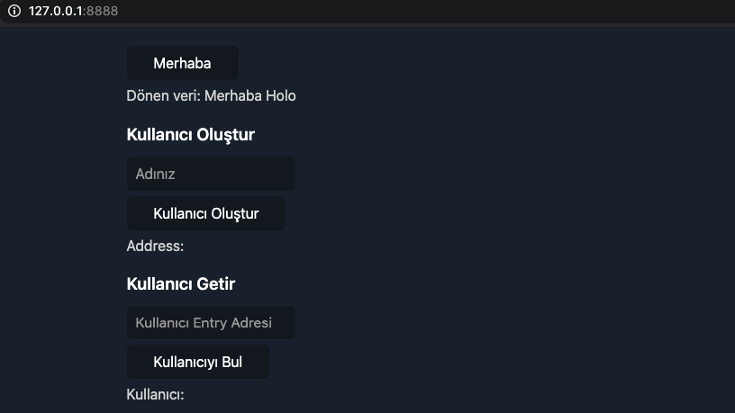
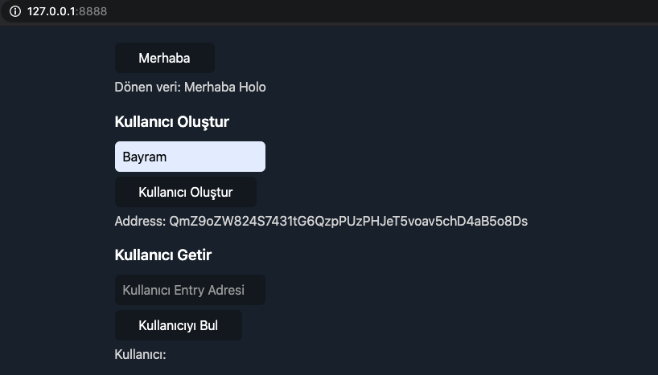
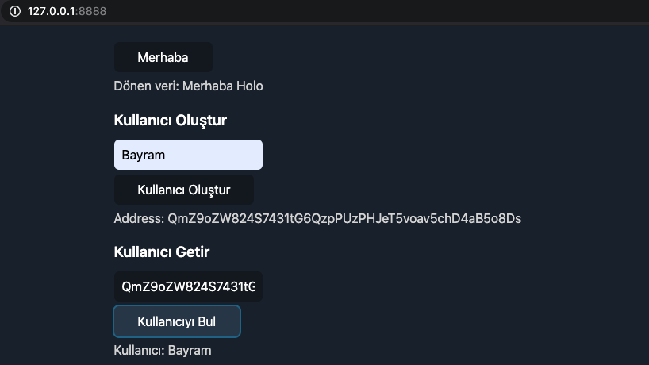

# Holochain Me

## Uygulama Hakkında
* Uygulama holochain - rust ilişkisi kullanılarak servisi hazırlandı.
* Uygulama içinde ortama uygun kullanıcı kayıt ve o kullanıcı bilgilerini döndüren servisler yazıldı.
* Servislerden dönen veriler Web ortamında gösterilmek üzere hazırlandı.


## Gerekli Hazırlıklar

* [Nix](https://nixos.org/) kurulumu yapılmalıdır.

## Nasıl çalıştırılır

### Nix ortamını hazırlama

``` console
$ nix-shell https://holochain.love
```

### Paketleri derleme

``` console
$ cd cc_tuts
$ hc package
```

### Test

``` console
$ hc test
```

### Uygulamayı başlatma

``` console
$ hc run
```

### Uygulamayı önizleme

#### [http://127.0.0.1:8888/](http://127.0.0.1:8888/)

## Ekran Görüntüleri

### İlk Görüntü


### Kullanıcı oluşturma


### Kullanıcı getir
